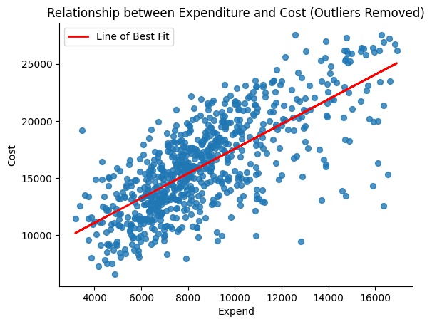
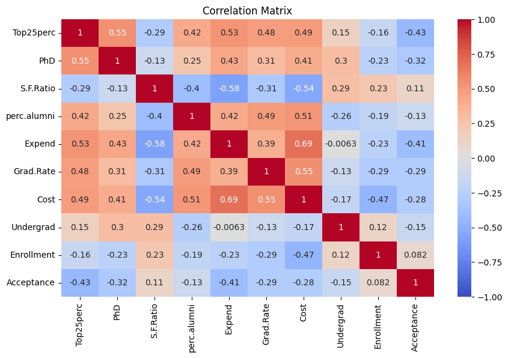
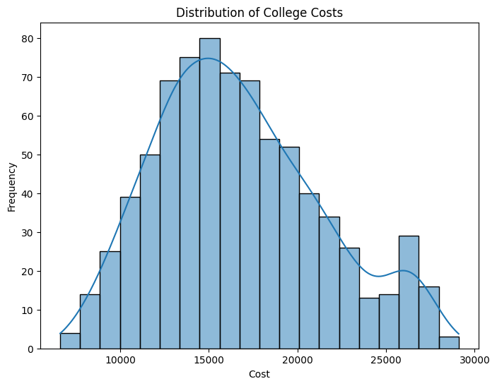
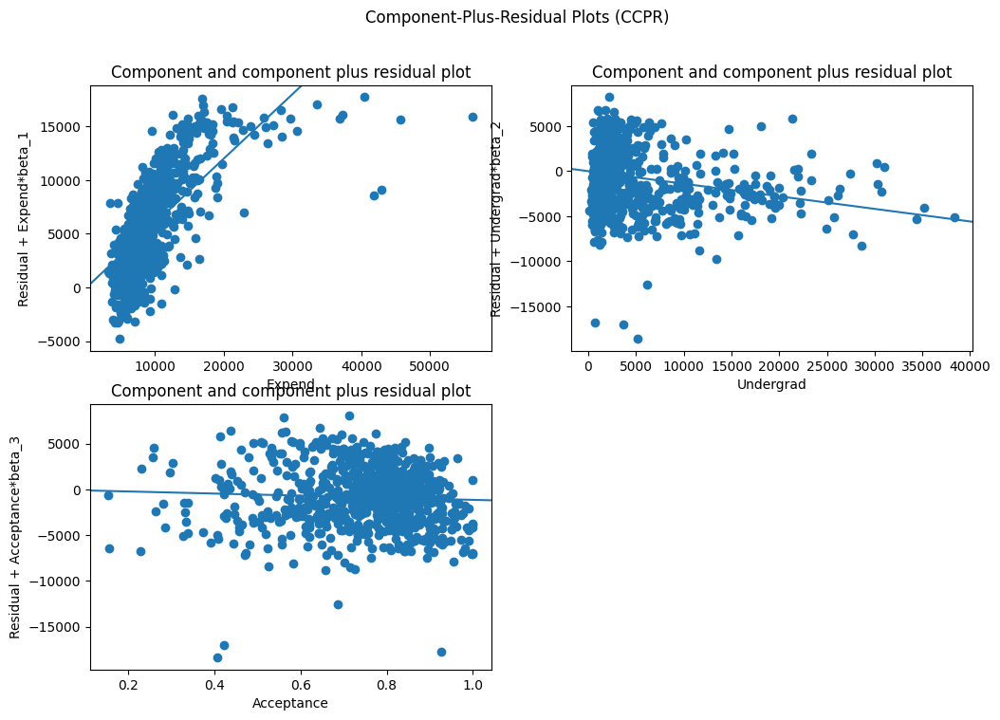

# College Cost Analysis & Predictive Modeling

## Overview

This project analyzes data from 777 U.S. colleges to identify the factors that influence college attendance costs and predict tuition using multiple linear regression.

The analysis combines exploratory data analysis (EDA), feature engineering, statistical modeling, and regression diagnostics to uncover meaningful insights into the drivers of higher education costs.

## Business Problem

College affordability is an important issue for students and families. This project investigates which institutional characteristics contribute most to higher costs.

## Dataset

- 777 U.S. colleges
- Public and Private Institutions

## Technologies Used

- Python
- Pandas
- NumPy
- Matplotlib
- Statsmodels
- Jupyter Notebook

## Key Findings

- Private colleges cost approximately $5,356 more than public colleges.
- Private institutions spend roughly $3,028 more per student.
- Regression model explained approximately 50% of tuition variation.

## Business Impact

This project demonstrates how statistical modeling can be used to better understand college affordability. The findings highlight how institutional spending and college type influence attendance costs, providing data-driven insights that could support students, families, and higher education decision-makers.

## Visualizations

### Relationship Between Expenditure and College Cost

This scatter plot illustrates the positive relationship between institutional expenditure per student and the overall cost of attendance. Colleges with higher spending per student generally have higher attendance costs.

---

### Correlation Heatmap

The correlation matrix highlights the strength of relationships among numerical variables. It helped identify which features were most strongly associated with college costs before developing the predictive model.

---

### College Cost Distribution

The distribution of attendance costs across 777 U.S. colleges shows substantial variation between institutions, emphasizing the complexity of predicting tuition and overall costs.

---

### Regression Diagnostics

Regression diagnostic plots were used to evaluate model assumptions, including residual behavior and overall model fit, ensuring the validity of the multiple linear regression model.

## Repository Contents

- CollegeCostAnalysis.ipynb
- README.md

## Future Improvements

- Compare additional machine learning models
- Expand feature engineering using additional institutional variables
- Develop an interactive Power BI dashboard
- Perform cross-validation and compare alternative regression techniques

## Conclusion

This project demonstrates how exploratory data analysis and multiple linear regression can be used to better understand the factors influencing college attendance costs. By combining statistical modeling with data visualization, the analysis provides meaningful insights into institutional spending patterns and tuition differences while reinforcing the importance of data-driven decision-making.

## Business Recommendations

Based on the analysis:

- Institutions with higher expenditures per student generally have higher attendance costs.
- Students comparing colleges should evaluate institutional spending alongside tuition.
- Future models could incorporate additional variables such as financial aid, graduation rates, and geographic location to improve predictive accuracy.
